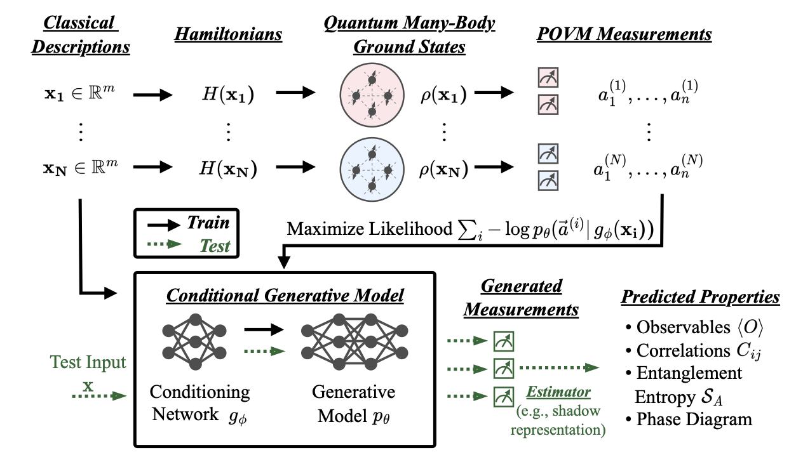

# Predicting Properties of Quantum Systems with Conditional Generative Models

This repo contains the code accompanying the paper "_Predicting Properties of Quantum Systems with Conditional
Generative Models_" [[arXiv](https://arxiv.org/abs/2211.16943)].



If you find this repo useful for your research, please consider citing our paper:

```bibtex
@article{cond-generative-quantum-states,
  title={Predicting Properties of Quantum Systems with Conditional Generative Models},
  author={Wang, Haoxiang and Weber, Maurice and Izaac, Josh and Lin, Cedric Yen-Yu},
  journal={arXiv preprint arXiv:2211.16943},
  year={2022},
}
```

## Requirements

### Software

+ Python (tested with python 3.8 & 3.9)
    + Please see `requirements.txt` for the required Python packages (if you are using pip or Conda, you can
      run `pip install -r requirements.txt`)
    + Pytorch-Geometric (PyG): Please refer to
      its [official documentation](https://pytorch-geometric.readthedocs.io/en/latest/notes/installation.html) for
      installation.
        + PyG is used in our experiments on 2D Heisenberg models (our conditional generative model has a GNN module in
          that case).
    + Jax: Please refer to its [official documentation](https://github.com/google/jax#installation) for installation (a
      CPU version is sufficient).
        + `jax` and `neural-tangents` (a Jax-based package) are only used when comparing our method with Neural Tangent
          Kernel (used by Hsin-Yuan Huang et al. in their [Science 2022](https://arxiv.org/abs/2106.12627) paper). You
          can skip this installation if you do not intend to do the comparison.
+ Julia (tested with version 1.7 & 1.8)
    + The Julia language can be downloaded from the [official website](https://julialang.org/downloads/) (If you are
      using pip or Conda as your python package manager, you can also install Julia with
      the [Jill](https://github.com/johnnychen94/jill.py) package).
    + Run `julia install_pacakges.jl` in the `rydberg/` folder to install all necessary Julia packages.
        + If you want to use GPU for simulation, you need to install the `CUDA` and `Adapt` packages in addition (
          see `rydberg/README.md` for details).

### Hardware

+ To train the models, we recommend using a GPU with at least 16GB memory (otherwise, you may need to use a smaller
  batch size).

+ For inference with our pre-trained models, a CPU is sufficient (may need to decrease the batch size to accommodate the
  memory).

## Data & Pre-trained Models

**Download** - All simulation data & pre-trained models can be downloaded from this [**Google Drive
folder**](https://drive.google.com/drive/folders/1AWXaXjMyiFeBsjXr6EV05VXzdG1SGGqo?usp=sharing).
It contains two sub-folders, `data/` and `logs/`. Please put them in the root of this repo after downloading.

### Simulation Data

In the paper, we use the following datasets:

+ Heisenberg Models (`data/2d_heisenberg_data/`)
    + Our simulated data with [PennyLane](https://github.com/PennyLaneAI/pennylane) (generated using our
      code `heisenberg_generate_data.py`)
    + [Hsin-Yuan Huang](https://hsinyuan-huang.github.io/)'s simulated data, available in
      [this GitHub repo](https://github.com/hsinyuan-huang/provable-ml-quantum).
+ Rydberg Atom Systems (`data/rydberg/`)
    + Our simulated data via [Bloqade.jl](https://queracomputing.github.io/Bloqade.jl/) (generated using our code
      in `rydberg`)
        + 1D Rydberg-atom chains of 13,15,...,33 atoms.
        + 2D Rydberg-atom square lattices of 5x5 atoms (with various adiabatic evolution times for the ground-state
          preparation).

#### Processing Open-source Heisenberg Data

First clone the [provable-ml-quantum](https://github.com/hsinyuan-huang/provable-ml-quantum) repo. Since our scripts
expect the data to be organized slightly differently, and to create train and test splits, we provide the
`reorganize_heisenberg_data.py` script. Run it as follows:

```bash
python reorganize_heisenberg_data.py <path/to/provable-ml-quantum/heisenberg/data>
```

This will reorganize the data and save it to `data/2d_heisenberg_data/{rows}x{cols}/{split}/`.

### Pre-trained Models

We trained conditional transformers over the simulation data. If you want to directly load pre-trained models when using
our scripts, please put them in `logs/`.

#### Heisenberg Models

In Sec. III-A of the paper, we conducted various numerical experiments over Heisenberg models of various sizes.
The trained models are saved in `logs/2d_heisenberg_checkpoints/`.

#### Rydberg Atoms

In Sec. III-B of the paper, we conducted 4 machine learning experiments over Rydberg atom systems, and we provide
pre-trained models for them in different sub-folders. Notice that we trained models for a different number of
iterations, and marked them with suffixes like `...{#iterations}.pth` (e.g., `...100k.pth` implies training with 100k
iterations).

+ Sec. III-B(1) - _Predicting quantum phases_
    + `logs/rydberg_1D/`: models trained on 1D Rydberg-atom chains of 31 atoms.
    + `logs/rydberg_2D/`: models trained on 2D Rydberg-atom chains of 25 atoms (prepared with adiabatic evolution of 3.0
      μs)
+ Sec. III-B(2) - _Predicting phases of larger quantum systems_
    + `logs/rydberg_1D-size/`: models trained on 1D Rydberg-atom chains of 13,15,...,27 atoms.
+ Sec. III-B(3) - _Predicting phases of ground states prepared with longer adiabatic evolution time_
    + `logs/rydberg_2D-time/`: models trained on 2D Rydberg-atom square lattices of 5x5 atoms, which are prepared with
      adiabatic evolution of 0.4, 0.6, 0.8, 1.0 μs.

## Tutorials

In this repo, we also provide tutorials that are intended to communicate the ideas of our paper in a more interactive
manner.

+ **Heisenberg Models.** The notebook `Tutorial-2D-Heisenberg.ipynb` first introduces the 2D random Heisenberg model,
  and
  shows how correlations and entanglement entropies of its ground states can be calculated. In the second part, we show
  how a pretrained conditional generative model can be used to generate samples corresponding to a ground state of a
  random
  Heisenberg Hamiltonian. Finally, in the last part, we walk you through the code used to train a transformer model,
  conditioned on the coupling graph, which was embedded by a graph convolutional neural network.

+ **Rydberg Atom Systems.** The notebook `Tutorial-Rydberg-1D.ipynb` introduces 1D Rydberg atom systems, loads
  simulation data of such systems with 31 atoms (generated via Julia in `rydberg/`), and plots the phase diagram of 1D
  Rydberg-atom chains based on the simulation data. Then, we demonstrate how to train a conditional generative model
  over
  a subset of the simulation data (you can also directly load a pre-trained model from `logs/rydberg_1D/`). With the
  trained model, you can generate measurements for any new Rydberg-atom system of the same kind, and predict its phases
  (Disordered, $Z_2$-ordered, or $Z_3$-ordered). In this tutorial, we use the trained model to predict the entire phase
  diagram of 1D Rydberg-atom chains (31 atoms), and compare it with the predicted phase diagrams by several kernel
  methods (introduced by Hsin-Yuan Huang et al. in their [Science 2022](https://arxiv.org/abs/2106.12627) paper) - you
  can see
  that the prediction by our method is much more accurate that these kernel methods.

## **Conditional generative models for 2D anti-ferromagnetic random Heisenberg models**

### Dataset

+ **Generate your own data**

You can generate your own dataset consisting of randomized Pauli measurements using the
script `generate_heisenberg_data.py`.
The script first samples random coupling matrices of the specified dimensions, calculates the corresponding ground state
using exact diagonalization and then samples random Pauli measurements using the
[Classical Shadow implementation in PennyLane](https://docs.pennylane.ai/en/stable/code/qml_shadows.html).
For example, if you want to create a dataset for a `4x4` lattice, with 40 train Hamiltonians and 10 test Hamiltonians,
with 500 measurements for each Hamiltonian, you can run

```shell
python heisenberg_generate_data.py --nh_train 40 --nh_test 10 --rows 4 --cols 4 --shots 500 
```

The resulting data will be saved under `data/2d_heisenberg/4x4` with two sub-folders `train` and `test` for the
respective data splits.

+ **Open source data**

For systems with 20 and more qubits, we have used publicly available data from
[this GitHub repo](https://github.com/hsinyuan-huang/provable-ml-quantum) by Hsin-Yuan Huang. These datasets were
simulated using DMRG. Or, you can directly download the data from
our [Google Drive folder](https://drive.google.com/drive/folders/1XiAAX9aoYzEbpUYzyBCZjz6PTK8BH5a7?usp=sharing).

### Training models

To train a conditional generative model for the 2D anti-ferromagnetic random Heisenberg model, you can use the
script `heisenberg_train_transformer.py`. An example command is

```shell
python heisenberg_train_transformer.py --train-size 4x4 --train-samples 500
```

which uses the default hyperparameters used throughout the paper and trains a model on all the Hamiltonians
sampled in the previous step. Note that this is compute-intensive and should be run with GPU support.
If you want to quickly test on CPUs, you can set the flag `--hamiltonians 1` to use data from only a single Hamiltonian.

### Generating samples from trained models

To generate samples from a trained conditional generative model, you can use the script
`heisenberg_sample_transformer.py`. The flag `--results-dir` indicates the directory pointing to the run package where
the results of a training run have been saved. Note that this should be the root of the results directory and not the
`checkpoints` folder, as this script requires access to flags set during training and saved to the `args.json` file.

### Evaluating properties with classical shadows

Evaluating properties of ground states of the Heisenberg model can be done using the script
`heisenberg_evaluate_properties.py`. Note that this requires you to have completed the previous steps and generated
samples from a trained model using the script `heisenberg_sample_transformer.py`. Similar to the previous step, the flag
`--results-root` indicates the directory pointing to the run package where the results of a training run have been
saved.
The flag `--snapshots` indicates the number of samples (i.e., snapshots) which will be used to estimate the correlation
functions and the entanglement entropies. We use the classical shadow implementation in PennyLane to compute these
properties.

## **Conditional generative models for Rydberg atom systems**

### Dataset

You can generate your own dataset using our Julia simulation code in `rydberg/`. Or, you can download the data from
this [Google Drive folder](https://drive.google.com/drive/folders/1XiAAX9aoYzEbpUYzyBCZjz6PTK8BH5a7?usp=sharing).

### Machine Learning Experiments

To reproduce our experiments on Rydberg atom systems, you can check out the following Jupyter notebooks
(with detailed descriptions inside):

+ Sec. III-B(1) - _Predicting quantum phases_
    + 1D Lattices: `Tutorial-Rydberg-1D.ipynb`
    + 2D Lattices: `notebooks/Experiment-Rydberg-2D.ipynb`
        + Furthermore, we provide a demo, `notebooks/Demo-Rydberg-2D-Phases.ipynb`, to visualize phases of 2D
          Rydberg-atom lattices (in both the real space and the Fourier space).
+ Sec. III-B(2) - _Predicting phases of larger quantum systems_
    + `notebooks/Experiment-Rydberg-1D-LargerSystems.ipynb`
+ Sec. III-B(3) - _Predicting phases of ground states prepared with longer adiabatic evolution time_
    + `notebooks/Experiment-Rydberg-2D-LongerEvolution.ipynb`

## Acknowledgements

We found several very helpful codebases when building this repo, and we sincerely thank their authors:

+ [Bloqade.jl](https://github.com/QuEraComputing/Bloqade.jl): A Julia package for neutral-atom simulations.
+ [provable-ml-quantum](https://github.com/hsinyuan-huang/provable-ml-quantum): Official implementation for [*Provably
  efficient machine learning for quantum many-body problems*](https://arxiv.org/abs/2106.12627).
+ PennyLane Tutorials:
    + [Classical Shadows](https://pennylane.ai/qml/demos/tutorial_classical_shadows.html): A Python re-implementation of
      Hsin-Yuan Huang's [classical shadows code (C++)](https://github.com/hsinyuan-huang/predicting-quantum-properties).
    + [Machine learning for quantum many-body problems](https://pennylane.ai/qml/demos/tutorial_ml_classical_shadows.html):
      A Python implementation of [*Provably efficient machine learning for quantum many-body
      problems*](https://arxiv.org/abs/2106.12627).
+ [The Annotated Transformer](http://nlp.seas.harvard.edu/annotated-transformer/): An annotated version of the paper
  [*Attention Is All You Need*](https://arxiv.org/abs/1706.03762) by Vaswani et al., in the form of a line-by-line
  implementation.

## Version History

Initial release (v1.0): Nov 2022

## Team

Current maintainers:

+ [Haoxiang Wang](https://haoxiang-wang.github.io) ([@Haoxiang__Wang](https://twitter.com/haoxiang__wang),
  hwang264@illinois.edu),
+ [Maurice Weber](https://mauriceweber.github.io) ([@mauriceweberq](https://twitter.com/mauriceweberq),
  maurice.weber@inf.ethz.ch)

## License

Apache 2.0 
