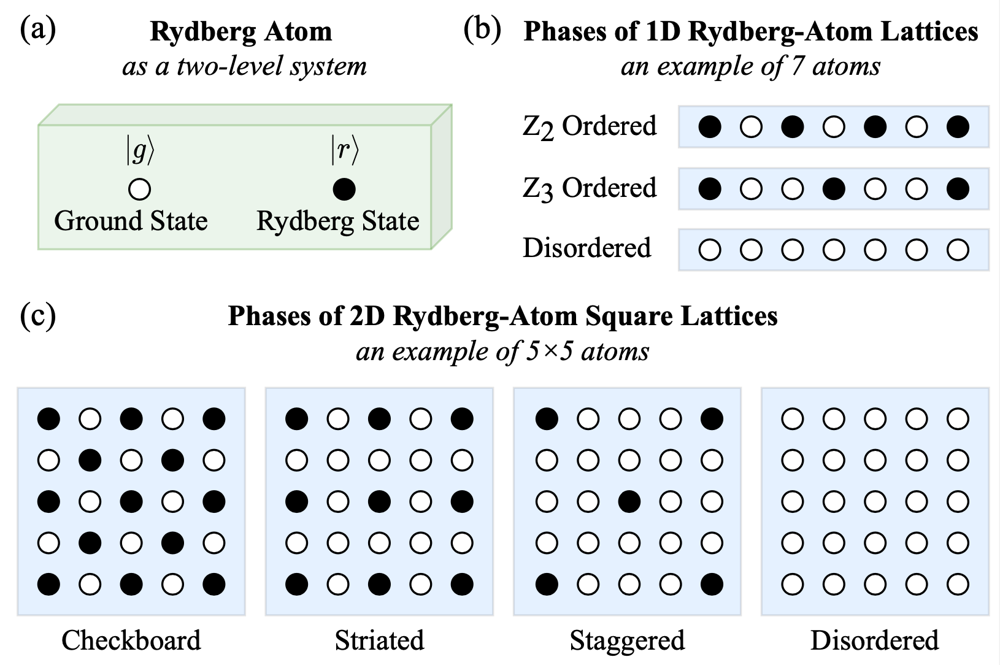

# Simulations of Rydberg Atom Systems
This folder contains our code to simulate Rydberg atom systems (1D and 2D), with either CPUs or GPUs as the backend.

## Installation
In order to run the simulation, you need to install some required Julia packages - we provide them in a script (`install_packages.jl`), and you can simply install all of them by running the command `julia install_packages.jl`.

## Simulation

The Julia script `rydberg_evolution.jl` contains our simulation code. We write two Python scripts, `launch_1D.py` and `launch_2D.py`, to launch multiple simulations at once.

You can customize simulation configurations in `launch_1D.py` or `launch_2D.py`:
+ `use_cuda:bool = False` - Switch to `True` if you want to simulate on a NVIDIA GPU. In this case, you need to install the `CUDA.jl` Julia package (e.g., run `using Pkg; Pkg.add("CUDA")` in Julia).
+ `gpu_idx:int = 0` - The GPU you want to use for simulation. It needs to be defined only as i) you want to simulate on GPU and ii) your machine have multiple GPUs.
+ `nx:int` - The number of atoms allocated in the second dimension. 
  + For 1D lattices, you need to define a list `n_qubist`, and then `nx` will enumerate over the list (to launch a sequence of experiments for different lattice sizes).
+ `ny:int` - The number of atoms allocated in the second dimension. 
  + Note: This is only needed when you simulate 2D square lattices; For 1D, this variable is set as `1`.
+ `n_threads:int = 0` - The number of threads to use in the multi-thread setting (each thread runs one simulation experiment). Note: when you use GPu for simulation, all threads launch experiments on the same GPU.
  + `n_threads = 0` - Use a single thread.
  + `n_threads = -1` - Use as many CPU threads as possible.
  + `n_threads > 0` - Use the number of threads you customize (it will use fewer threads if the number of experiments is smaller than `n_threads`).
+ `solver:str = "Vern8"` - The ODE solver to use for the simulation. `Vern8` is the default, and you can also try solvers such as `VCABM`. These two are recommended by `Bloqade.jl`.
+ `blockade_subspace:bool = True` - Whether to use the blockade subspace approximation (supported by `Bloqade.jl`). 
  + Note: Switching it to `False` will slow down simulation when you have >20 atoms.
+ `total_time:float = 3`: The time length (μs) of the adiabatic evolution.
  + In `launch_2D.py`, we set a list `total_times:List[float]` to launch a sequence of experiments with various `total_time`.
+ `itr_init:float`: The smallest value of *interaction range* (defined as $R_0/a$ in our paper) for simulation. 
+ `itr_final:float`: The largest value of *interaction range* for simulation. 
+ `itr_step:float`: The step size of the interaction ranges for simulation.

You can also specialize more configurations by passing the following arguments to `rydberg_evolution.jl`:
+ `n_shots:int = 1000`: The number of measurement snapshots for each state to be measured.
+ `data_folder:str = "../data/rydberg/"`: The parent folder to save simulated data.